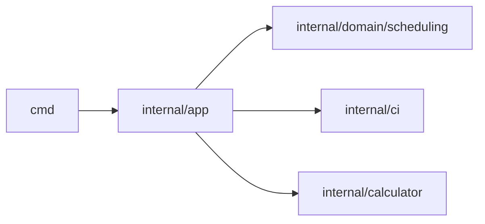

# Carbon Guard

**The CLI that guilt-trips your CI pipeline into sustainability.**


Carbon Guard helps engineering teams make CI emissions visible, enforce carbon budgets, and schedule workloads in greener windows.

## Quick Navigation

| I want to... | Go here |
| --- | --- |
| Start in 1 minute | [Quick Start](#quick-start) |
| Use it in GitHub Actions | [`docs/action.md`](docs/action.md) |
| See all CLI flags & outputs | [`docs/commands.md`](docs/commands.md) |
| Understand architecture | [`docs/architecture.md`](docs/architecture.md) |
| Configure cache/env/thresholds | [`docs/configuration.md`](docs/configuration.md) |
| Understand governance/review policy | [`docs/governance.md`](docs/governance.md) |

## What You Get

- `run`: runtime carbon report (`kgCO2`) with budget and baseline support.
- `suggest` / `run-aware`: carbon-aware scheduling for a single zone.
- `optimize` / `optimize-global`: multi-zone optimization over forecast windows.
- Local CLI and Docker-based GitHub Action with a stable output contract.
- Zero runtime dependencies (Go standard library only).

## Quick Start

### Local CLI

```bash
go install github.com/czy/carbon-guard@latest
carbon-guard run --duration 300 --json
```

### GitHub Action

```yaml
- name: Record start time
  run: echo "START_TIME=$(date +%s)" >> $GITHUB_ENV

- name: Carbon Guard
  id: carbon
  uses: czy/carbon-guard@v1
  with:
    start_time: ${{ env.START_TIME }}

- name: Print emissions
  run: echo "emissions_kg=${{ steps.carbon.outputs.emissions_kg }}"
```

## Example Output

```text
-----------------------------------
Carbon Report
-----------------------------------
Duration: 300s
Estimated Emissions: 0.0067 kgCO2
Score: A 🌿
Equivalent to charging 1 smartphones
Equivalent to driving an EV 0.1 km
-----------------------------------
```

## Architecture Snapshot



## Repository Layout

```text
cmd/                 CLI parsing and presentation
internal/app/        use-case orchestration
internal/domain/     pure scheduling logic
internal/ci/         Electricity Maps providers + cache
docs/                user and maintainer documentation
.github/workflows/   CI and security automation
```

## Documentation

Start with [`docs/index.md`](docs/index.md).

- Action Guide: [`docs/action.md`](docs/action.md)
- Commands: [`docs/commands.md`](docs/commands.md)
- Configuration: [`docs/configuration.md`](docs/configuration.md)
- Troubleshooting: [`docs/troubleshooting.md`](docs/troubleshooting.md)
- FAQ: [`docs/faq.md`](docs/faq.md)
- Governance: [`docs/governance.md`](docs/governance.md)
- Release Process: [`docs/release.md`](docs/release.md)

## Community & Governance

- Contributing: [`CONTRIBUTING.md`](CONTRIBUTING.md)
- Security Policy: [`SECURITY.md`](SECURITY.md)
- Code of Conduct: [`CODE_OF_CONDUCT.md`](CODE_OF_CONDUCT.md)
- Changelog: [`CHANGELOG.md`](CHANGELOG.md)
- License: [`LICENSE`](LICENSE)
