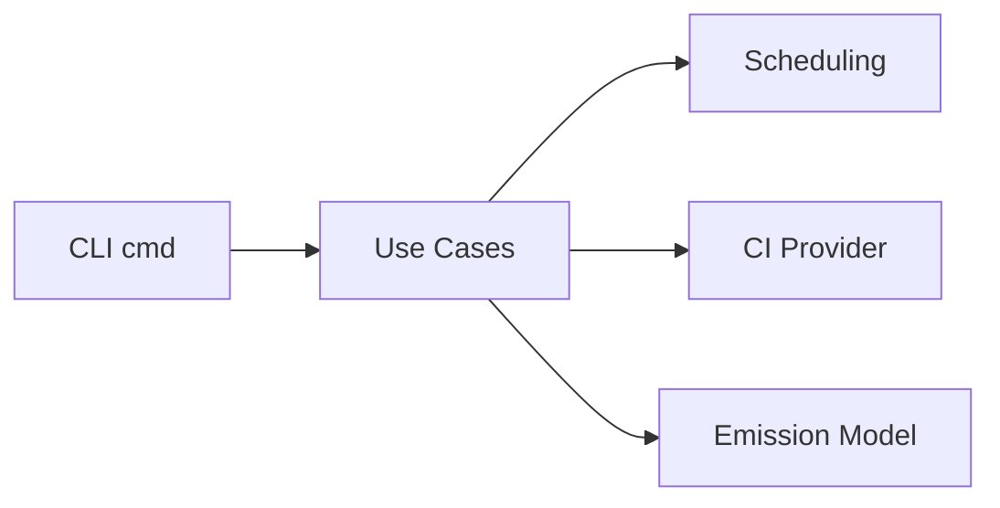

# Carbon Guard

**The CLI that guilt-trips your CI pipeline into sustainability.**


Carbon Guard turns CI runtime into a measurable carbon signal you can **report, compare, and enforce**.

---

## Quick Navigation

| Goal | Link |
| --- | --- |
| 1‑minute quick start | [Quick Start](#quick-start) |
| CLI flags & outputs | [`docs/commands.md`](docs/commands.md) |
| GitHub Action contract | [`docs/action.md`](docs/action.md) |
| Configuration (cache, env, timeouts) | [`docs/configuration.md`](docs/configuration.md) |
| Architecture | [`docs/architecture.md`](docs/architecture.md) |
| Governance | [`docs/governance.md`](docs/governance.md) |

---

## What You Get

- `run`: per‑run carbon report (`kgCO2`) with budget and baseline support.
- `suggest` / `run-aware`: carbon‑aware scheduling for a single zone.
- `optimize` / `optimize-global`: multi‑zone optimization over forecast windows.
- Local CLI and Docker‑based GitHub Action with a stable output contract.
- Zero runtime dependencies (Go standard library only).

---

## Quick Start

### Local CLI

```bash
go install github.com/chenzhuyu2004/carbon-guard@latest
carbon-guard run --duration 300 --json
```

### GitHub Action

```yaml
- name: Carbon Guard
  id: carbon
  uses: chenzhuyu2004/carbon-guard@v1
  with:
    duration: "300"

- name: Print emissions
  run: echo "emissions_kg=${{ steps.carbon.outputs.emissions_kg }}"
```

---

## Example Output

```text
-----------------------------------
Carbon Report
-----------------------------------
Duration: 300s
Estimated Emissions: 0.0067 kgCO2
Score: A
Equivalent to charging 1 smartphones
Equivalent to driving an EV 0.1 km
-----------------------------------
```

---

## How It Works (At a Glance)



---

## Repository Layout

```text
cmd/                 CLI parsing and presentation
internal/app/        use-case orchestration
internal/domain/     pure scheduling logic
internal/ci/         Electricity Maps providers + cache
docs/                user and maintainer documentation
.github/workflows/   CI and security automation
```

---

## Documentation Hub

Start with [`docs/index.md`](docs/index.md).

- Action Guide: [`docs/action.md`](docs/action.md)
- Commands: [`docs/commands.md`](docs/commands.md)
- Configuration: [`docs/configuration.md`](docs/configuration.md)
- Troubleshooting: [`docs/troubleshooting.md`](docs/troubleshooting.md)
- FAQ: [`docs/faq.md`](docs/faq.md)
- Governance: [`docs/governance.md`](docs/governance.md)
- Release Process: [`docs/release.md`](docs/release.md)

---

## Community & Governance

- Contributing: [`CONTRIBUTING.md`](CONTRIBUTING.md)
- Security Policy: [`SECURITY.md`](SECURITY.md)
- Code of Conduct: [`CODE_OF_CONDUCT.md`](CODE_OF_CONDUCT.md)
- Changelog: [`CHANGELOG.md`](CHANGELOG.md)
- License: [`LICENSE`](LICENSE)
- Support: [`SUPPORT.md`](SUPPORT.md)
- Citation: [`CITATION.cff`](CITATION.cff)
- Third-Party Notices: [`THIRD_PARTY_NOTICES.md`](THIRD_PARTY_NOTICES.md)
