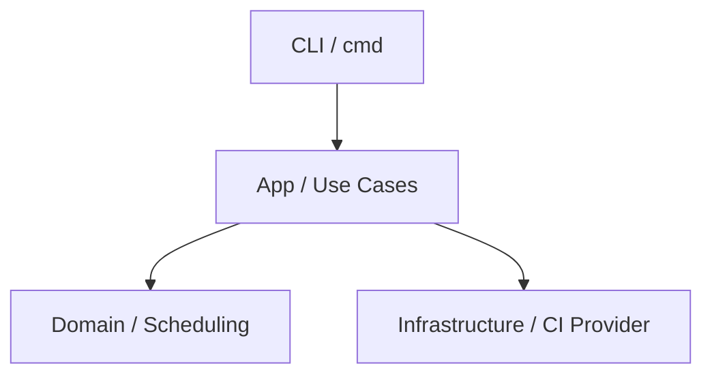

# Carbon Guard

**The CLI that guilt-trips your CI pipeline into sustainability.**


Carbon Guard helps engineering teams estimate CI emissions, enforce carbon budgets, and schedule workloads for lower-carbon windows.

## 30-Second Quick Start

### Local CLI

```bash
go install github.com/czy/carbon-guard@latest
carbon-guard run --duration 300 --json
```

### GitHub Action

```yaml
- name: Record start time
  run: echo "START_TIME=$(date +%s)" >> $GITHUB_ENV

- name: Carbon Guard
  id: carbon
  uses: czy/carbon-guard@v1
  with:
    start_time: ${{ env.START_TIME }}

- name: Print emissions
  run: echo "emissions_kg=${{ steps.carbon.outputs.emissions_kg }}"
```

## Product Forms

- Local binary CLI (`carbon-guard`)
- Docker-based GitHub Action (`uses: czy/carbon-guard@v1`)

## Architecture



See full architecture notes: [`docs/architecture.md`](docs/architecture.md)

## Core Commands

| Command | Purpose |
| --- | --- |
| `run` | Estimate emissions for a runtime (supports budget gate and baseline delta). |
| `suggest` | Recommend a lower-carbon execution window for one zone. |
| `run-aware` | Wait for better carbon conditions before running. |
| `optimize` | Compare zones and pick the lowest-emission option. |
| `optimize-global` | Joint optimization across zone and time axis intersection. |

### `run` key flags

| Flag | Description |
| --- | --- |
| `--duration` | Runtime in seconds. Required. |
| `--budget-kg` | Optional carbon budget in kgCO2. |
| `--fail-on-budget` | Fail command when budget exceeded. |
| `--baseline-kg` | Optional baseline kgCO2 for delta comparison. |
| `--json` | Machine-readable output. |

## GitHub Action Contract

### Inputs

| Name | Required | Description |
| --- | --- | --- |
| `duration` | No | Runtime in seconds. Highest priority when set. |
| `start_time` | No | Unix timestamp (seconds). Used when duration is empty. |
| `budget_kg` | No | Optional carbon budget in kgCO2. |
| `fail_on_budget` | No | If `true`, action fails when over budget. |
| `baseline_kg` | No | Optional baseline kgCO2 for percentage delta. |

### Outputs

| Name | Description |
| --- | --- |
| `emissions_kg` | Estimated emissions in kgCO2. |
| `budget_exceeded` | `true`/`false` when budget provided. |
| `delta_vs_baseline_pct` | Percentage delta vs baseline (if provided). |

Runtime resolution order:
1. `duration`
2. `start_time`
3. `GH_ACTION_START_TIME` (legacy env var)

Full Action docs: [`docs/action.md`](docs/action.md)

## Exit Codes

| Code | Meaning |
| --- | --- |
| `0` | Success |
| `1` | Input error |
| `2` | Provider/API error |
| `10` | Max wait exceeded |
| `11` | Missed optimal window |
| `12` | Timeout |
| `20` | No valid window found |
| `21` | Budget exceeded |

## PR Comment Preview

```md
## Carbon Guard Report

- Duration: `612s`
- Emissions: `0.0138 kgCO2`
- Budget: `0.0150 kgCO2` (within budget)
- Baseline: `0.0164 kgCO2`
- Delta vs baseline: `-15.85%`
```

## Example Workflows

- Report only: [`docs/examples/report-only.yml`](docs/examples/report-only.yml)
- Budget gate: [`docs/examples/budget-gate.yml`](docs/examples/budget-gate.yml)
- Baseline + PR comment: [`docs/examples/baseline-pr-comment.yml`](docs/examples/baseline-pr-comment.yml)

## Documentation Index

- Action guide: [`docs/action.md`](docs/action.md)
- Architecture: [`docs/architecture.md`](docs/architecture.md)
- Troubleshooting: [`docs/troubleshooting.md`](docs/troubleshooting.md)
- FAQ: [`docs/faq.md`](docs/faq.md)
- Release process: [`docs/release.md`](docs/release.md)

## Development

```bash
make test
make lint
make build
```

## Why Carbon Guard

CI energy is usually invisible. Carbon Guard turns it into an explicit, enforceable engineering signal.
