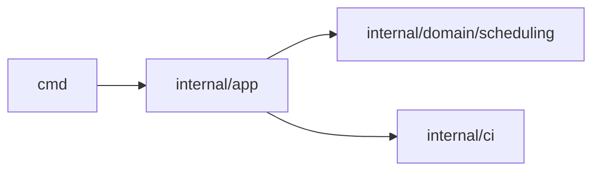

# Carbon Guard

**The CLI that guilt-trips your CI pipeline into sustainability.**


Carbon Guard turns CI runtime into a measurable carbon signal.
Use it as a local CLI or as a Docker-based GitHub Action.

## Why Carbon Guard

- Carbon visibility: estimate CI emissions in `kgCO2`.
- Carbon control: enforce budget gates in CI.
- Carbon optimization: suggest greener windows and zones.
- Engineering quality: zero-dependency Go + clean architecture.

## Quick Start

### Local CLI

```bash
go install github.com/czy/carbon-guard@latest
carbon-guard run --duration 300 --json
```

### GitHub Action

```yaml
- name: Record start time
  run: echo "START_TIME=$(date +%s)" >> $GITHUB_ENV

- name: Carbon Guard
  id: carbon
  uses: czy/carbon-guard@v1
  with:
    start_time: ${{ env.START_TIME }}

- name: Print emissions
  run: echo "emissions_kg=${{ steps.carbon.outputs.emissions_kg }}"
```

## Commands (Overview)

| Command | Purpose |
| --- | --- |
| `run` | Estimate emissions for one runtime (with optional budget/baseline). |
| `suggest` | Recommend a lower-carbon execution window for one zone. |
| `run-aware` | Wait until greener conditions or threshold target is met. |
| `optimize` | Compare multiple zones and rank by expected emission. |
| `optimize-global` | Global optimization over shared time axis + zone. |

Full CLI reference: [`docs/commands.md`](docs/commands.md)

## Architecture



Detailed notes: [`docs/architecture.md`](docs/architecture.md)

## Documentation

Start here: [`docs/index.md`](docs/index.md)

- Action guide: [`docs/action.md`](docs/action.md)
- Command reference: [`docs/commands.md`](docs/commands.md)
- Troubleshooting: [`docs/troubleshooting.md`](docs/troubleshooting.md)
- FAQ: [`docs/faq.md`](docs/faq.md)
- Release process: [`docs/release.md`](docs/release.md)

## Governance

- Contributing: [`CONTRIBUTING.md`](CONTRIBUTING.md)
- Code of Conduct: [`CODE_OF_CONDUCT.md`](CODE_OF_CONDUCT.md)
- Security Policy: [`SECURITY.md`](SECURITY.md)
- Changelog: [`CHANGELOG.md`](CHANGELOG.md)
- License: [`LICENSE`](LICENSE)
