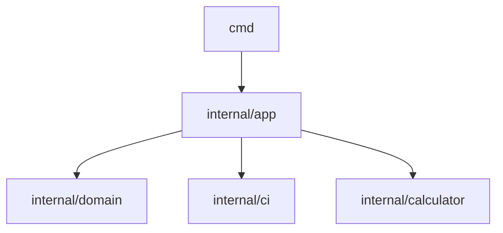

# Architecture

Carbon Guard follows a clean layered architecture.

## Layer Responsibilities

- `cmd`:
  - CLI flag parsing
  - output rendering
  - exit code mapping
- `internal/app`:
  - use-case orchestration (`run`, `suggest`, `run-aware`, `optimize`, `optimize-global`)
  - timeout / concurrency orchestration
  - typed app-level error model
- `internal/domain/scheduling`:
  - pure scheduling logic
  - time normalization/intersection/window checks
- `internal/ci`:
  - Electricity Maps provider adapter
  - cached provider (TTL + atomic write)
- `internal/calculator`:
  - emission model implementation

## Emission Model

Core model:

- `P = Idle + (Peak - Idle) * load`
- `Energy_IT = duration * P / 1000 / 3600`
- `Energy_total = Energy_IT * PUE`
- `CO2 = Energy_total * CI`

Segmented mode sums `CO2_i` over all segments.

## Contracts

- CLI output contract: text + JSON
- GitHub Action contract: explicit inputs/outputs and fail-fast behavior
- Error contract: standardized exit codes in `internal/errors/codes.go`
